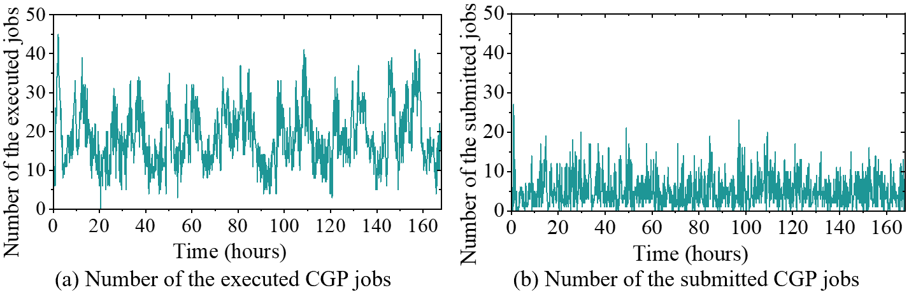

# Traces

## Introduction
This is a publicly available industry-based trace of the _Concurrent iterative Graph Processing_ (CGP) jobs for research. 

We collect one month job logs from the computing cluster of a social network company, i.e., [Tencent](https://www.tencent.com/en-us/about.html/), and plot one week’s job distribution from Mar. 1, 2021. Specifically, the CGP jobs in the real trace from Tencent are periodically executed offline jobs, and can be classified into two categories: all-active algorithms (all vertices are active at the beginning) and non-all-active algorithms (a subset of vertices are active at the beginning). The proportion of the former is about 22.2%, and that of the latter is 77.8%. Specifically, the all-active algorithms are the variants of PageRank, WCC, k-core, Label propagation, Louvain modularity, k-means, Graph coloring, MIS, Maximal matching, and Degree centrality, while the non-all-active algorithms are implemented based on SSSP or BFS.

From the above picture, two things become clear:
- The number of the CGP jobs is large: We observed many distinct graph processing jobs issued to the same platform. At peak time, there are more than 45 jobs pending on the platform. At scale, many of the existing graph processing techniques may be highly inefficient.

- The CGP jobs are periodically executed offline jobs: We observed the CGP jobs are periodically submitted to the same platform daily, and the number of the CGP jobs varies   periodically.

## Classification of the CGP jobs
The CGP jobs traced from Tencent can be classified into two categories: all-active algorithms and non-all-active algorithms. The former traverses the graph starting from all vertices while the latter starts from a subset of vertices.

| All-active algorithms | Non-all-active algorithms |
| ----- | ----------- |
|  The variants of PageRank, WCC, k-core, Label propagation, Louvain modularity, k-means, Graph coloring, MIS, Maximal matching, and Degree centrality | The variants of SSSP and BFS | 

## Licensing 
All data is subjected to the MIT open source licensing scheme. 
For more details, please see [licensing](LICENSE)

## Citations
TODO: Fill in this page once paper is published
